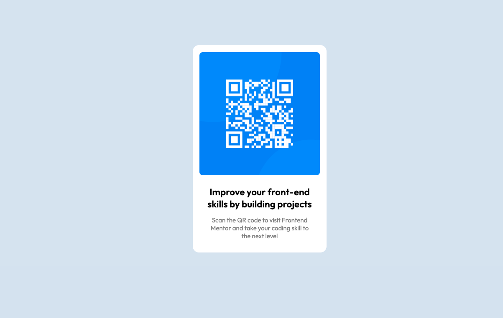

# Frontend Mentor - QR code component solution

This is a solution to the [QR code component challenge on Frontend Mentor](https://www.frontendmentor.io/challenges/qr-code-component-iux_sIO_H). Frontend Mentor challenges help you improve your coding skills by building realistic projects.

## Table of contents

- [Overview](#overview)
  - [Screenshot](#screenshot)
  - [Links](#links)
  - [Built with](#built-with)
  - [What I learned](#what-i-learned)
  - [Continued development](#continued-development)
  - [Useful resources](#useful-resources)
- [Author](#author)

## Overview

A QR Code component built with HTML and CSS.

### Screenshot

### Links

- Solution URL: https://www.frontendmentor.io/solutions/qr-code-component-tCBANXdD4V
- Live Site URL: https://qr-code-component-mu-taupe.vercel.app/
- GitHub Repo: https://github.com/ZounMedia/qr-code-component

## My process

### Built with

- Semantic HTML5 markup
- CSS custom properties
- Flexbox
- Mobile-first workflow

### What I learned

I learned the basics of html and css.

### Continued development

I would like to focus on my project setup for future projects. Regular css is ok for small projects like this one, but I will use SASS for larger HTML/CSS projects.

### Useful resources

- https://www.geeksforgeeks.org/how-to-include-a-font-ttf-using-css/ - This helped me learn how to load/work with .tff files.
- https://www.w3schools.com/html/html_favicon.asp - This helped me understand how to load favicons.

## Author

- Frontend Mentor - https://www.frontendmentor.io/profile/@rzounlom
